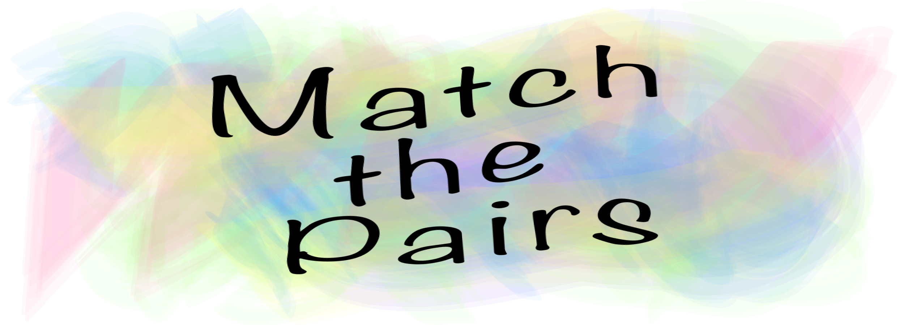
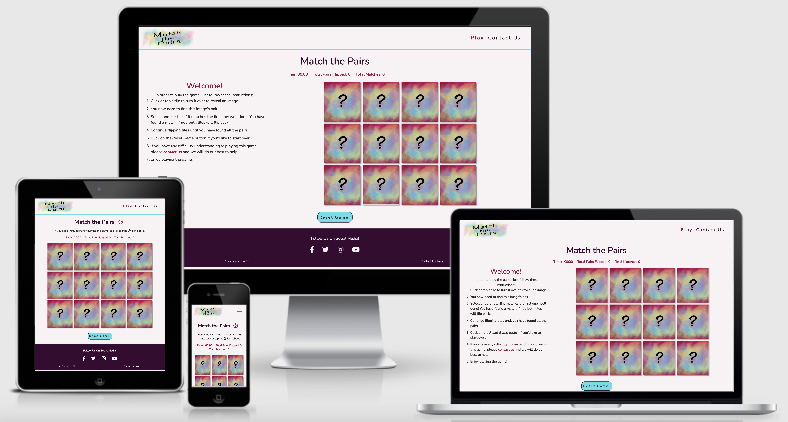
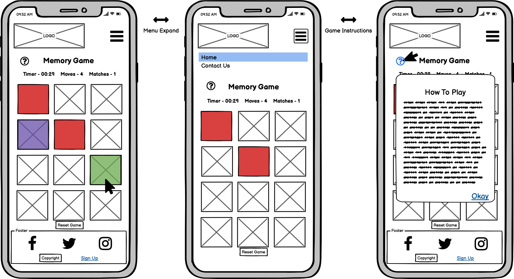
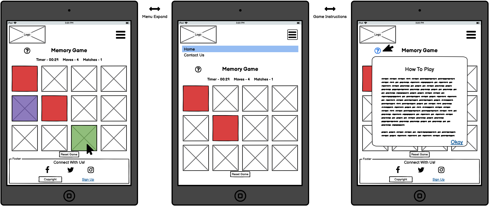
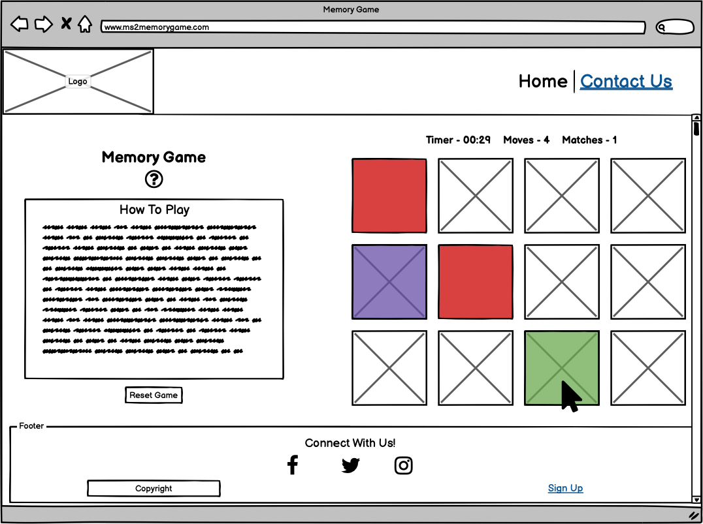
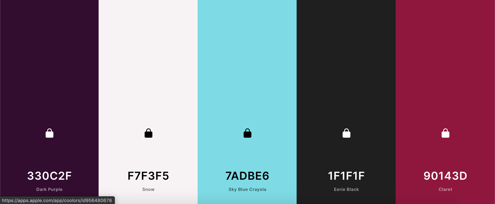

# 
**MS2: Match The Pairs**

 ### View the live project [here.](https://loftusn13.github.io/ms2-matchthepairs/index.html)

This website has been created as my submission for Milestone Project 2 
for the Code Institute. It is a card-matching memory game designed to be 
fun and interactive for users of all ages. The game is simple for the user 
to play and is responsive across a range of devices.   

---

## Contents
- [**User Experience (UX)**](#ux)
    - [Strategy](#strategy)
        - [User Stories](#user-stories)
        - [Site Owner Goals](#site-owner-goals)
    - [Scope](#scope)
    - [Structure](#structure)
    - [Skeleton](#skeleton)
    - [Surface](#surface)
 - [**Features**](#features)
    - [Existing Features](#existing-features)
    - [Features Left to Implement](#features-left-to-implement)
 - [**Technologies Used**](#technologies-used)
    - [Languages](#languages)
    - [Technologies](#technologies)
 - [**Testing**](#testing)
 - [**Deployment**](#deployment)
    - [GitHub Pages](#github-pages)
    - [Run Locally](#run-locally)
 - [**Credits**](#credits)
    - [Content](#content)
    - [Code](#code)
    - [Acknowledgements](#acknowledgements)

---
## 
**UX**

### **Strategy**
#### User Stories
- As a first-time visitor, I want the purpose of the website to be clear.
- As a first-time visitor, I want the site and the game to be visually appealing.
- As a first-time visitor, I want to easily find game instructions if I require them.
- As a first-time visitor, I want to easily be able to contact the site owners.
- As a first-time visitor, I want to be able to restart the game. 
- As a first-time visitor, I want to see my score as I'm playing the game.

#### Site Owner Goals
- Create a website with a memory game that users will enjoy playing.

### **Scope**
- A navigation bar must be provided to allow the user to easily navigate through the site.
- The landing page must immediately show the game so the user understands what kind of site they are visiting.
- Game instructions must be provided if the user requires them.
    - A modal containing game instructions is needed on mobile and tablet devices to keep the screen uncluttered.
- A clear way of contacting the site owners must be provided through the use of a contact form on the *Contact Us* page.
- A *Reset* button must be provided to allow the user to start the game over.
- A *Timer* and *Score* count must be provided to improve game experience.
- The website must be visually consistent throughout to keep the user comfortable.
- The website must be responsive across different devices.
- A *Leader Board* containing the highscores of the game will be left as a feature to be implemented and so will **not** be included in this release.
- A *Difficulty Level* function, which changes the game depending on the chosen level, will be left as a feature to be implemented and so will **not** be included in this release.

### **Structure**
The site has a simple and clear structure consisting of just two pages, *Play* and *Contact Us*. Both pages contain the same navigation bar and footer to allow for user navigation ease.
The two pages are also consistent in colour and design to ensure the user is comfortable. 

#### Play Page
- Will contain the actual game and clear instructions for how to play.
- On larger devices, the instructions will be clearly shown beside the game.
- On smaller devices, the instructions will be available through a modal. The user will see a clear prompt on how to access this modal.
- Instructions on all devices contain a link to the *Contact Us* page.

#### Game
- Will contain twelve game tiles.
- Will contain a timer that will begin once the user clicks on the first tile and that will stop once the game is over.
- Will flip the tile that the user has clicked to reveal an image. This image will remain until the user clicks on another tile;
    - if the two tiles match, then the images will remain.
    - if the two tiles do not match, then the images will flip back.
- Will count how many moves the user has made and will display this count.
- Will count and display how many pairs have been matched.
- Will end when the user has matched all of the pairs.
- Will contain a *Reset* button that will restart the game and shuffle the tiles.
- Will shuffle the tiles for each new game played.

#### Navigation Bar
- Will contain the site logo which acts as a link to the *Play* page.
- Will contain clear names of the site pages for navigation ease.
- Will remain consistent throughout the site.
- Will turn into a hamburger menu style on smaller devices.

#### Contact Page
- Will contain links to different social media platforms.
    - As the site owners do not have social media accounts, these links will brings the user to the main social media platform rather than to a particular account.
- Will contain a contact form for the user to fill out with a field for *Name*, *Email Address*, *Your Feedback/Query* and a *Submit* button. 
- Once the form is submitted, the user will receive an automated reply to the email address that they entered to confirm their message/query has been received.

#### Footer
- Will contain links to different social media platforms.
    - As the site owners do not have social media accounts, these links will brings the user to the main social media platform rather than to a particular account.
- Will remain consistent throughout the site.
- Will contain a link to the *Contact Us* page.

#### Links 
- Will change colour when the user hovers over them to reinforce they are clickable links.
- External links to the social media platforms will open in new tabs.
- Internal site links will bring the user to the correct and expected place.

### **Skeleton**
All wireframes were created using [Balsamiq](https://balsamiq.com/).
#### Mobile - Home Page

#### Tablet - Home Page

#### Desktop - Home Page

Full PDF versions of all wireframes can be found below;
- [Mobile Wireframes](documentation/wireframes/mobile)
- [Tablet Wireframes](documentation/wireframes/tablet)
- [Desktop Wireframes](documentation/wireframes/desktop)

### **Surface**
#### Design
The design for the website is clean and uncluttered so the user is not distracted from the game they
have come to play. On mobile and tablet devices the game takes up the whole screen with game instructions
appearing in the form of a modal if the user requires them. This helps to maintain a clean design. On larger
screens both the game and game instructions sit side by side. The overall design and appearance needs to be
fun and appealing so that a user immediately understands what kind of site they are visiting. The Nunito font
was also chosen as it creates a more casual and less serious look.

#### Colour
As the site is primarily for game play I wanted to ensure that the colours used were not dull or
boring while also ensuring they didn't distract from the game itself. I used [Coolors.co](https://coolors.co/) to 
create the colour scheme found below. The *Contrast Checker* tool was also used to check that all content would be
easily seen. The placement of each colour was chosen to keep the site as clean and legible as possible.
- 330C2F Dark Purple
- F7F3F5 Snow
- 7ADBE6 Sky Blue Crayola
- 1F1F1F Eerie Black
- 90143D Claret

#### Imagery
The images used for the game tiles were chosen as they're all bright and colourful but not so much so that they 
are a distraction from the game or site itself. They are also different enough so that the user does not find it 
difficult to tell the images apart while looking for the matches.

---
## 
**Features**

The site is clean and simple, being responsive across various devices and maintaining design consistency throughout.
Both pages on the site serve their own purpose making it easy to navigate for the user. Only features relevant to
game-play and contacting site owners are included to avoid any site clutter or confusion. The same footer and navigation 
bar are included on both pages.

#### Play Page 
- The landing page containing the game itself and game instructions; immediately showing purpose of site.
- A link to the *Contact Us* Page is provided. 

#### Contact Us Page 
- Links to social media platforms (*Facebook, Twitter, Instagram and YouTube*) are provided.
- Can be accessed through the navigation bar link, footer link or the link within the game instructions on the landing page.
- Contains a contact form for users to fill out if they wish to contact the site owners.

### **Existing Features**
- **Game Panel**
    - Contains a *timer* that begins once the user clicks on the first tile and ends when all the pairs have been matched.
    - Contains a *counter* which counts how many pairs of tiles have been flipped, regardless of how many are matches.
    - Contains a *counter* which counts how many matches have been made.

- **Match the Pairs Game**
    - Contains twelve game tiles and is responsive across devices.
    - When the page is reloaded or the game reset, all game tiles are face-down.
    - The user can click on one tile and then they choose a second. While the game quickly checks if the two tiles match, other tiles are locked 
    (cannot be clicked on) to avoid any confusion.
    - If those two tiles match then they will remain flipped and the user can select another two tiles.
    - If those two tiles do not match then they will flip back and the user will need to select another two tiles.
    - The game will end when all pairs have been matched.
    - When all pairs have been matched, a popup modal will appear which displays the user's score and the time it took them to finish the game.
        - Within this modal the user has the option to click a *Play Again* button or to click anywhere on the screen; either of which will cause the 
        page to reload so that they can play the game again or navigate through the site.
    - The *Reset Game* button will reload the page, allowing the user to start over if they wish.

- **Site Logo**
    - The ***Match the Pairs*** logo in the left of the navigation bar exists on all site pages
    on every device, and acts as a link to the *Play* Page to allow users to easily return to the landing page.

- **Navigation Bar**
    - The navigation bar at the top of the page exists on all site pages on every device to allow users to easily 
    navigate through the site, ensuring the user will not get lost.
    - Contains clear names of both site pages (*Play* and *Contact Us*) so the user knows what to expect from each page.
    - On smaller devices (small tablets and mobiles) the bar turns into a hamburger-style menu to free up screen real estate.
    When clicked, it expands to show the page names.
    - On the full and collapsed menu, the current active page name is bold and a different colour, allowing users to easily see which page they are on. 
    When other page names are hovered over, the font colour changes and it becomes underlined, confirming to users that it is a link.

- **Social Media Links**
    - Four social media links for *Facebook, Twitter, Instagram* and *YouTube* exist in the footer on both site pages on every device and also on the 
    *Contact Us* Page.
    - All four links are in the form of the appropriate and familiar social media icons, allowing users to know which platform they can expect to be brought to.
    - When each icon is hovered over, the icon colour changes, confirming to users that it is a link.
    - All four links open in a new tab so that the user does not lose their way back to the site.
    - All four links will only bring the user to the general social media platform rather than to a specific profile.

- **Contact Form**
    - Contained on the *Contact Us* page
    - A contact form with fields for **Name, Email Address, Your Feedback/Question:** and a **Submit button** exists on every device, which allows the user to contact the site owners
    if they wish to do so.
    - Each of the fields has a label to ensure the user knows what information is required.
    - Each field is required and upon clicking the **Submit button**, if any field is left blank, users are alerted to this via a "Please fill out this field" message which will appear 
    beneath the empty field. This allows users to easily see and understand why they cannot submit the form.
    - Users are also alerted if the **Email Address** field is filled out incorrectly, i.e. wrong format, missing a "." or "@". If incorrect, users are alerted to this via a message 
    which will appear beneath the field explaining what the problem is. This allows users to easily identify and fix the mistake. 
    - Once the form has been successfully submitted, a "success" message will appear below the **Submit button** to alert the user that their message has been sent correctly.
    - The site owner will receive an email containing the users information from the contact form.
    - The user will receive an email to the email address they provided confirming that the site owner has received their message.

### **Features Left to Implement**
- **Leader Score Board**
    - A score board that stores and displays the highest scores/quickest times of the game. This would allow the user to keep track of their own scores 
    and/or try to beat their own scores or other users scores.

- **Difficulty Levels**
    - Allowing the user to choose the difficulty of the game or increasing the game's difficulty as the user progresses through the game.

---
## 
**Technologies Used**

### **Languages**
- HTML5
- CSS3 
- JavaScript

### **Technologies**
- [Adobe Illustrator](https://www.adobe.com/ie/products/illustrator.html) - used to create the site logo and game tile image.
- [Am I Responsive?](http://ami.responsivedesign.is/) - used to create the multi-device image found at the top of this file.
- [Adobe Photoshop](https://www.adobe.com/ie/products/photoshop.html) - used to resize and optimise all images for web.
- [Balsamiq](https://balsamiq.com/) - used to create wireframes.
- [Bootstrap](https://getbootstrap.com/)  - used throughout the website for responsive layouts across devices and various styling. 
- [Coolors](https://coolors.co/) - used to choose colour scheme and for contrast-checking of chosen colours.
- [EmailJS](https://www.emailjs.com/) - used to set up email template for contact form submission.
- [Font Awesome](https://fontawesome.com/) - used icons to create social media links.
- [Git](https://git-scm.com/) - version control software used to commit and push code to GitHub.
- [GitHub](https://github.com/) - hosting site used to store the source code of the site with [GitHub Pages](https://pages.github.com/)
used to deploy the live site.
- [Google Chrome DevTools](https://developers.google.com/web/tools/chrome-devtools) - used for inspecting various page elements and identifying any layout issues/bugs. 
- [Google Fonts](https://fonts.google.com/specimen/Nunito?query=nunito) - selected Nunito font.

---
## 
**Testing**

Testing information and content for this project can be found in the [separate TESTING.md](./TESTING.md) file.

---
## 
**Deployment**

This project used the Code Institute's student [template](https://github.com/Code-Institute-Org/gitpod-full-template). A new repository named **ms2-matchthepairs**
was created which included all branches from the template. The project was developed using the IDE [GitPod](https://www.gitpod.io/). Version control software [Git](https://git-scm.com/) was used to commit and push the code to 
[GitHub](https://github.com/) where it was stored. The following commands were used for this:
- **git add** ***filename/directory*** - This command adds files/directories to the staging area to be committed.
- **git commit -m** *"message here"* - This command commits files/directories to the repository. Commit messages should clearly explain the update being committed.
- **git push** - This command pushes all committed updates/changes into the GitHub repository.

### **GitHub Pages**
To deploy to [GitHub Pages](https://pages.github.com/) these steps were followed:

- Log into GitHub.
- Navigate to the **Repositories** tab. 
- Choose the desired repository.
- Navigate to the **Settings** tab underneath the repository name.
- Scroll down until you reach the **GitHub Pages** section.
- Under **Source** click on the **None** drop-down menu and choose **master branch**.
- Click **Save** and the page will refresh automatically.
- Scroll back down to the **GitHub Pages** section.
- You'll see *"Your site is published at"* followed by the site link.
- The website has been deployed.

### **Run Locally**
In order to make a clone, follow these steps:

- Log into GitHub.
- Navigate to the **Repositories** tab. 
- Choose the desired repository.
- Above the list of files, click on the **Code** drop-down menu.
- Copy the clone URL under the **HTTPS** tab.
- Open a terminal window in your IDE of choice.
- Change the working directory to whichever location you want the cloned directory to be in.
- Type *git clone* and then paste the URL that you copied earlier.
- Press enter.
- Your local clone has now been created.

---
## 
**Credits**

### **Content**
- All content on the site was written by me.
- All images and graphics are my own.

### **Code**
- Code for site **modal** on *Play Page* taken and adapted from [w3schools.com](https://www.w3schools.com/bootstrap/bootstrap_modal.asp).
- Code for memory game functions taken and adapted from [Memory Game by Marina Ferreira](https://marina-ferreira.github.io/tutorials/js/memory-game/).
- Code Institute's [EmailJS module](https://courses.codeinstitute.net/courses/course-v1:CodeInstitute+IFD101+2017_T3/courseware/03d3f6524ad249d9b33e3336d156dfd0/e4710f80cdf34bffbd607bc102482d5c/?activate_block_id=block-v1%3ACodeInstitute%2BIFD101%2B2017_T3%2Btype%40sequential%2Bblock%40e4710f80cdf34bffbd607bc102482d5c) 
was used to help set up the contact form submission.
- Code to detect if a user is using Safari to alert them to a known bug (as noted in the [separate TESTING.md](./TESTING.md) file) was taken from [this post](https://stackoverflow.com/questions/7944460/detect-safari-browser/31732310#31732310) from Stack Overflow and my mentor, Spencer Barriball.
- [Stack Overflow](https://stackoverflow.com/) was a helpful resource for any minor code issues.
- Code for memory game counters and the **Congratulations modal** (which appears when the game ends) has been taken and adapted from [scotch.io](https://scotch.io/tutorials/how-to-build-a-memory-matching-game-in-javascript#toc-3-moves).

### **Acknowledgements**
- My mentor, Spencer Barriball for his helpful feedback and advice. 
- Friends and family who viewed the website and played the game on their own devices and provided any feedback where necessary. 