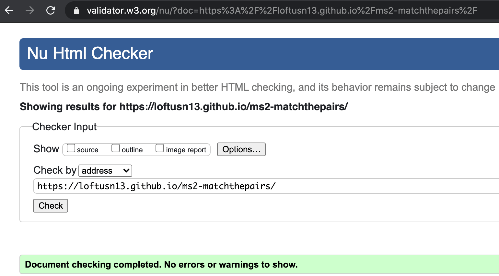
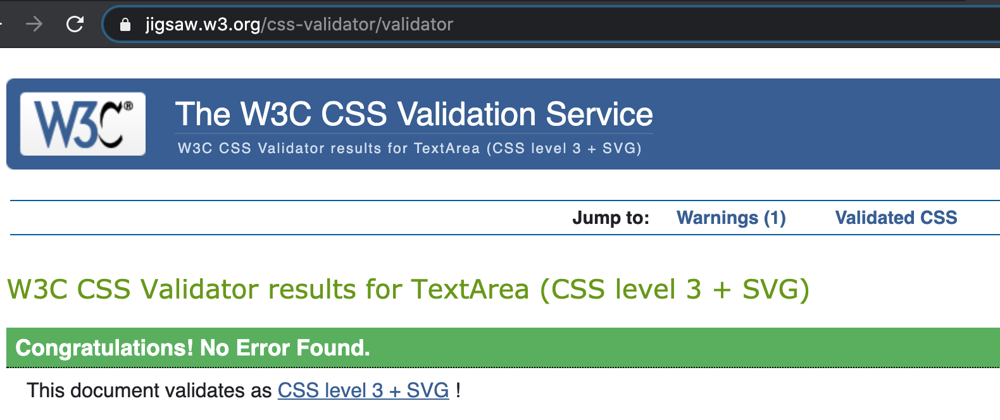
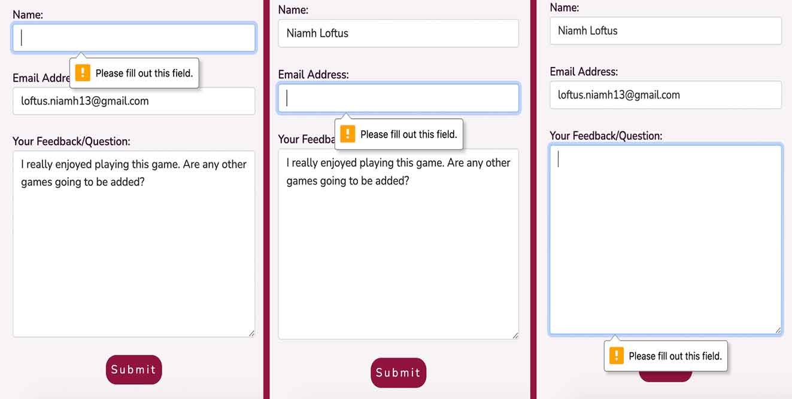
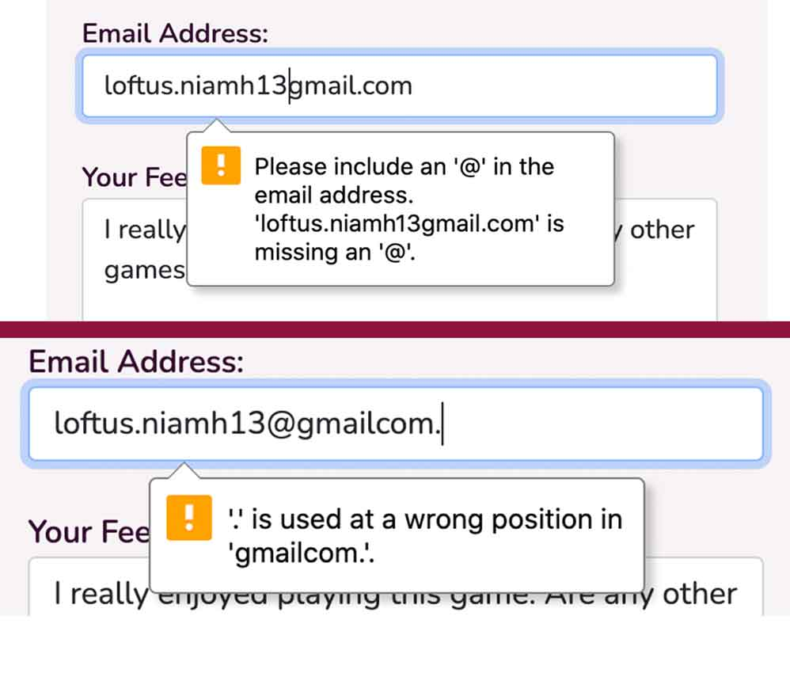
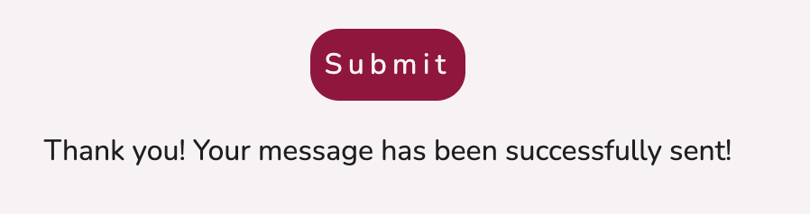
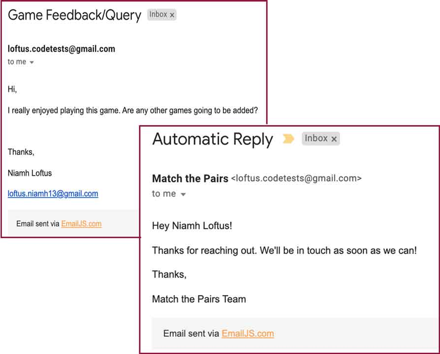
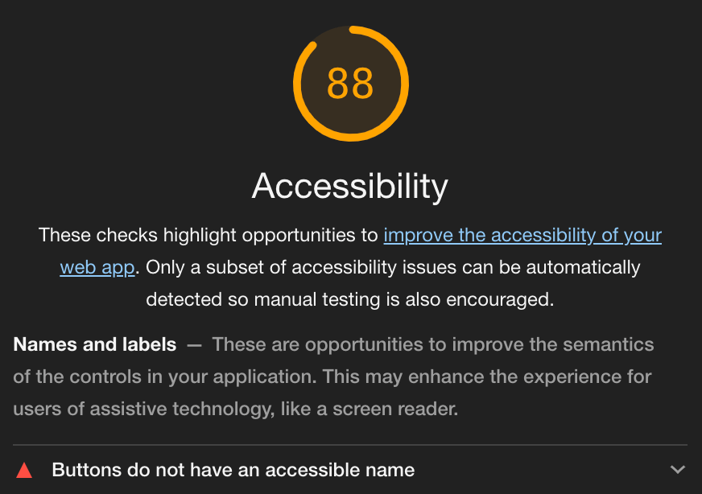
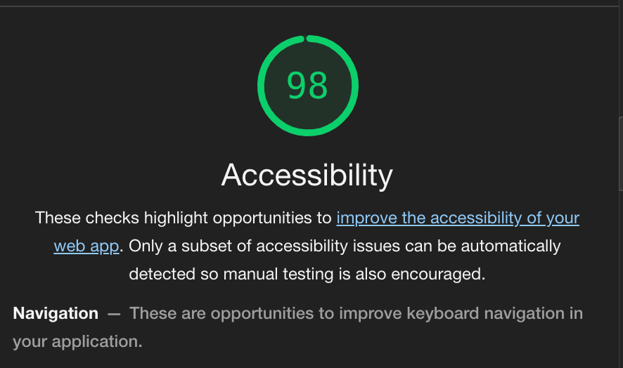
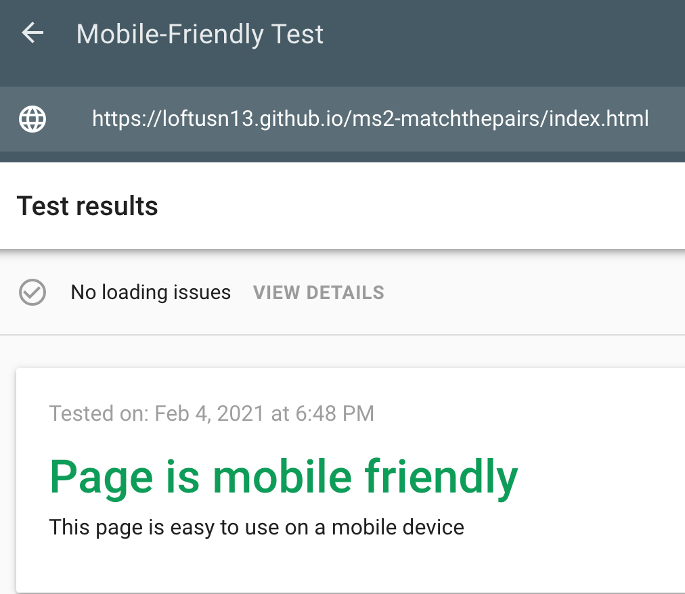
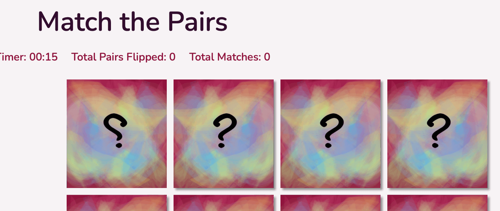

# 
**MS2: Match The Pairs**

### View the live project [here.](https://loftusn13.github.io/ms2-matchthepairs/index.html)
### View the main README file [here.](./README.md)

---
## Contents
- [**Testing**](#testing)
    - [Code Validation](#code-validation)
    - [Links Testing](#links-testing)
    - [Navigation Testing](#navigation-testing)
    - [Contact Form](#contact-form)
    - [Memory Game](#memory-game)
    - [Accessibility](#accessibility)
    - [Device Testing](#device-testing)
    - [Browser Testing](#browser-testing)
    - [Known Bugs](#known-bugs)
    - [Testing User Stories](#testing-user-stories)

---
## 
**Testing**

### **Code Validation**
- All HTML code for both site pages was checked and validated with [W3C Markup Checker](https://validator.w3.org/). No errors or warnings reported.

- All CSS code was checked and validated with [W3C CSS Validation Service](https://jigsaw.w3.org/css-validator/). No errors or warnings reported.

### **Links Testing**
- I manually tested each link on both pages of the site to ensure that none were broken and to ensure that each link would bring the user to the right location.
- Each link correctly changes colour when hovered over to emphasis to a user that it is clickable.
- All external links to social media platforms open correctly in new tabs and bring the user to the expected platform.
- All internal site links work correctly and bring the user to the right and expected site page.

### **Navigation Testing**
- I manually tested the site's navigation bar to ensure navigation ease on both full and hamburger-style menus on different devices. 
    - This was done by using [Chrome DevTools](https://developers.google.com/web/tools/chrome-devtools) and also manually testing on physical devices.
- The collapsed hamburger-style menu correctly appears on mobile and smaller tablet devices; this makes the site appear cleaner but is also still obvious to the user that it is a means of navigating.
- On both the full and collapsed menu, the active site page is in a bolder font and different colour so that the user always knows where they are on the site. 

### **Contact Form**
- I manually tested the contact form on the *Contact Us* Page to ensure it worked correctly.
- My testing of the form consisted of the following steps;
    - Navigating to the *Contact Us* Page via the link in the navbar, footer or *Play* Page.
    - I attempted to submit the form leaving one of the three fields empty each time.
    - I made note of the error alert that appears upon clicking the **Submit button** (as seen in the image below).
    

    
    - I attempted to submit the form with an incorrect *Email Address* format, missing the "@" and with the "." in the wrong place.
    - I made note of the error alert that appears upon clicking the **Submit button** (as seen in the image below).
    

    
    - I filled in all form fields correctly (with my own email address) and submit it.
    - I made note of the success message that appears upon submitting the form successfully (as seen in the image below) and of a small bug, details of which can be found [here.](#known-bugs).
     

    - I checked the email inbox of the site owner to ensure the submitted contact form details were received correctly (as seen in the image below).
    - I checked the email inbox of the email address provided in the form (my own) to ensure the automated response was received (as seen in the image below).
    

### **Memory Game**
The functionality of the game was manually tested to ensure there are no problems with any aspect of game play.

### **Accessibility**
- I manually checked;
    - all images throughout the site (game tiles and navbar logo) to ensure that they contained an *alt* attribute.
    - all social media icons to ensure that they contained a description for screen-reader users.
- I also tested the site's accessibility using [Lighthouse](https://developers.google.com/web/tools/lighthouse) in [Chrome DevTools](https://developers.google.com/web/tools/chrome-devtools);
    - the first initial test (as seen in the image below) alerted me to the lack of labels on some button elements. 
    

   
    - I corrected this by ensuring all buttons had an appropriate label which improved the overall accessibility of the site (as seen in the below image).
    

    - I noted the suggestion that keyboard navigation could be improved, this is something that will be looked at at a later date. 

### **Device Testing**
- I manually tested the site on a number of devices to ensure functionality and responsivity.
- I also used [Chrome DevTools](https://developers.google.com/web/tools/chrome-devtools), as mentioned previously, in order to view the site on a range of different screen dimensions.
- I tested on my own devices and also reached out to friends and family in order to test a wider range.
- The following devices were used for manual testing:
    - **Android Mobile**
        - Huawei: P10, P30 Lite, P30.
        - Samsung: Galaxy A40 and Galaxy A5.
        - No errors or issues noted on the above devices.
    - **Apple Mobile**
        - iPhone: 6, 8, 11.
        - Bug noted on the above devices, details of which can be found [here.](#known-bugs)
- I also ran the site through [Google's Mobile-Friendly Test](https://search.google.com/test/mobile-friendly) and received the below result:

- From this testing, my own and feedback from friends and family:
    - The site is easy to navigate.
    - The site is fully responsive across devices.
    - The game works and is simple and straightforward to play (with the exception noted [here](#known-bugs)).

### **Browser Testing**
- I manually tested the site on several different browsers to ensure functionality and responsivity.
- The following browsers were used for manual testing on an Apple Macbook Pro:
    - **Google Chrome:** Site works well with no issues noted.
    - **Safari:** Bug noted, details of which can be found [here.](#known-bugs)
    - **Opera:** Site works well with no issues noted.
    - **Microsoft Edge:** Site works well with no issues noted.
- The following browsers were used for manual testing on various mobile devices:
    - **Google Chrome:** Site works well on Android but there is a bug noted on Apple, details of which can be found [here.](#known-bugs)
    - **Safari:** Bug noted, details of which can be found [here.](#known-bugs)

### **Known Bugs**
- Upon submitting the **Contact Form** successfully, there is a slight delay in the *Success message* appearing.
    - Further testing will be required to fix this bug.
- The **Safari** browser and **Google Chrome** (on Apple devices) does not allow the user to play the game. 
    - The timer and counters begin as normal once a user clicks the first tile.
    - When a user clicks on a game tile, the tile flips but the image underneath is not shown meaning the user cannot match images.
    

    
    - As seen in the above image, the top left tile is the one that was clicked but the image is not showing, instead the top tile image has just reversed.

### **Testing User Stories**
- **"As a first-time visitor, I want the purpose of the website to be clear."**

- **"As a first-time visitor, I want the site and the game to be visually appealing."**

- **"As a first-time visitor, I want the game to be fun and easy to play."**

- **"As a first-time visitor, I want to easily find game instructions if I require them."**

- **"As a first-time visitor, I want to easily be able to contact the site owners."**

- **"As a first-time visitor, I want to be able to restart the game. "**

- **"As a first-time visitor, I want to see my score as I'm playing the game."**